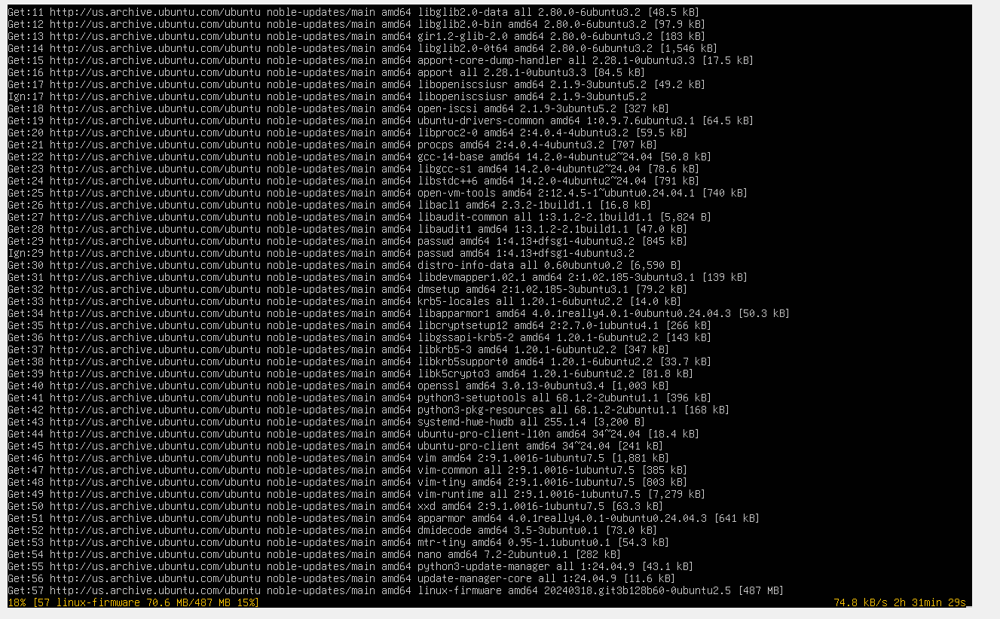
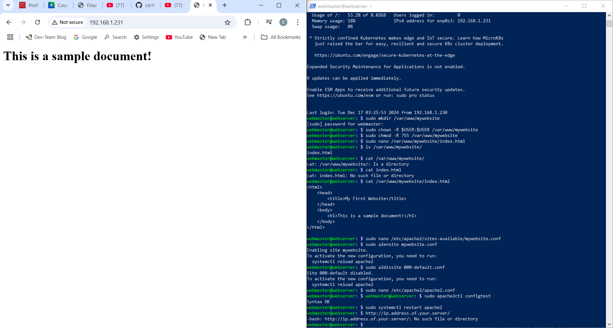
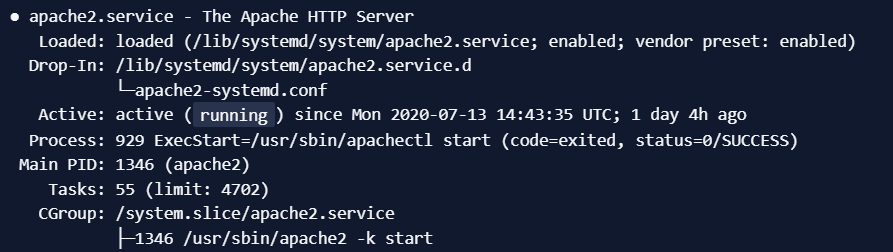

# Deliverable 2

## Server specs

## Configuring

## Sample site

## 1.	What is the IP address of your Ubuntu Server Virtual Machine?
The IP is 192.168.1.231

### 2.	How do you enable the Ubuntu Firewall?
Use the command `sudo ufw enable`

### 3.	How do you check if the Ubuntu Firewall is running?
Use the command `sudo ufw status`

### 4.	How do you disable the Ubuntu Firewall?
Use the command `sudo ufw disable`

### 5.	How do you add Apache to the Firewall?
Use command `sudo ufw allow 'Apache'`

### 6.	What is the command you used to install Apache?
Use the command `sudo apt install apache2 -y` to install Apache

### 7.	What is the command you use to check if Apache is running?
Use the command `sudo systemctl status apache2`

### 8.	What is the command you use to stop Apache?
Use the command `sudo service apache2 stop`

### 9.	What is the command you use to restart Apache?
Use the command `sudo service apache2 restart`

### 10.	What is the command used to test Apache configuration?
Use the command `sudo apachectl -t`

### 11.	What is the command used to check the installed version of Apache?
Use the command `sudo apache2 -v`

### 12. What are the most common commands to troubleshoot Apache errors? Provide a brief description of each command.
`systemctl` - Used to control and interact with Linux services via the systemd service manager.

`journalctl` - Used to query and view the logs that are generated by systemd.

`apachectl` - When troubleshooting, this command is used to check Apache’s configuration.

### 13. Which are Apache Log Files, and what are they used for? Provide examples and screenshots.
This is an Apache Log file. `/var/log/httpd/error_log`. 
Apache log files are used for troubleshooting, generally, any error that you receive in a browser or other HTTP client will have a corresponding entry in Apache’s logs.
